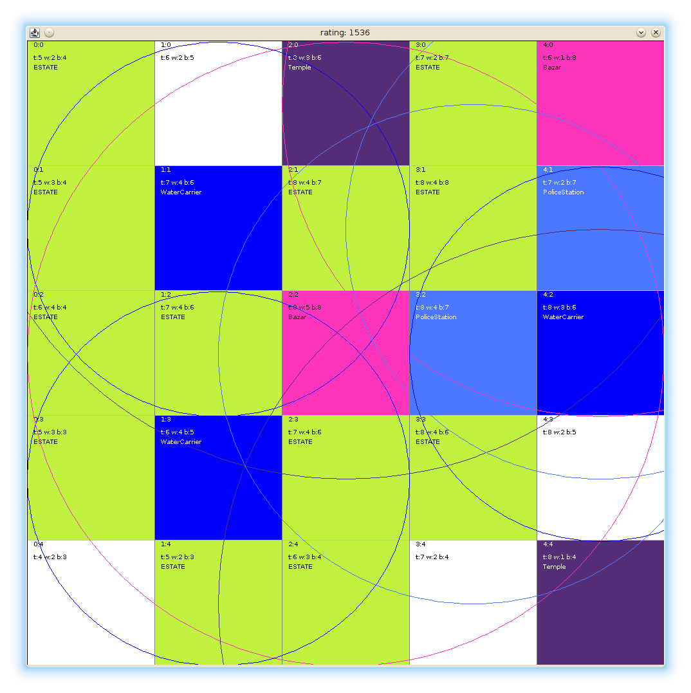

ai-optimiser-CityBuilder
=======

A city planning optimiser.

Implementation 2 (started 2021) - In development

* Will use a NN, with TF for GPU acceleration. 
* Swith to Python
* Split out the rendering from the learning.
* Will support flexible domains (ie, more games/scenarios!)

Implementation 1 (approx 2015) - Functional

* Uses asingle-gene evolutionary/genetic algorithm 
* Uses no special frameworks - just the CPU, and swing for drawing the output.
* The domain is a simple 90s video game called [Pharaoh](https://en.wikipedia.org/wiki/Pharaoh_(video_game)).
* Java

